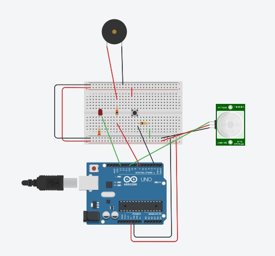

# N2020-IOT
## Integrantes

```
Abraão Azevedo RM83983
Geovanne Amorim RM82578
Iago Garcia RM82448
Luis Guilherme RM80389
Nicolas Nunes RM82331
Rodrigo Tanaka RM83888
```

## Proposta do prototipo

- Criar uma espécie de "pulseira" que consegue emitir notificações com base em uma string(enviada por API), emitindo som e acendendo um LED. Colocando 2 métodos diferentes para desativar, sendo possivel apertando um botão, ou se aproximando do sensor.

## Equipamentos utilizados 

- Arduino Uno R3
- Placa de ensaio
- Resistores
- Botão
- Sensor PIR(Proximidade)
- Piezo(som)
- LED

## Overview do prototipo no tinkercad


<a href="https://www.tinkercad.com/things/lg6vPxdv8Ue-ps-iot/editel?sharecode=8j6stlUjoZoEXxeVi63XUX9tdY9mfQnMThEdx77wxIQ">
  Link para o tinkercad
</a>
